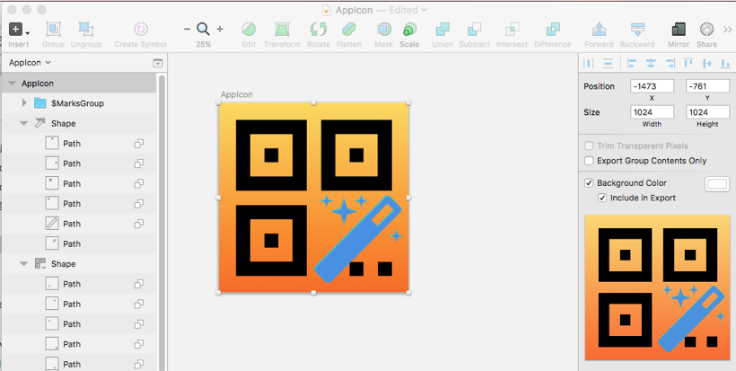
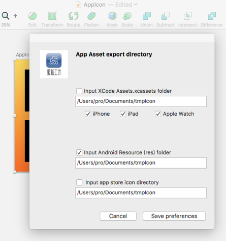
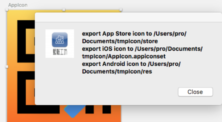
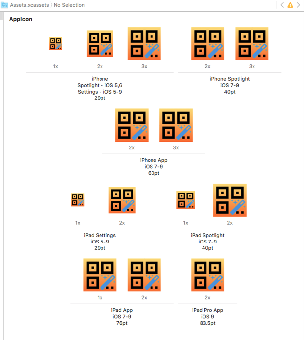
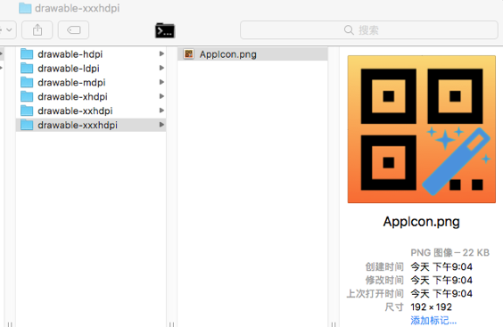

#Sketch Plugin:App Asset export 

Sketch3 plugin, One key export Android/iOS App icons.

Export various size icons for Android / iOS / iPhone App.

##Guide

1. Create a 1024x1024 size layer for Icon design.

2. Click the Plugins -> App Asset Export -> Perferences to inputing icon output path (only once).

3. Click the Plugins -> App Asset Export -> Export App Icons output, bingo!

## Result:

1  iOS AppIcon.xcassets

2 Android Icon

3 App Store Icon

#中文版说明 

App Asset Export ,Sketch 插件,一键输出生成Android/iOS/iPhone App 所需各种尺寸图标.
每种图标严格按设计标准输出.极大减轻了Icon设计者的输出工作量.

##1.使用方法

1.  建一个1024x1024大小图层进行Icon设计
2.  打开Plugins-->App Asset Export-->Perferences 配置各个平台输出路径(只需要一次)
3.  打开Plugins-->App Asset Export-->Export App Icons 输出,bingo!

如果你觉得好用,可以用微信支付捐款支持我们

 

或支付宝捐款
 

##2.本插件优点:

+   Icon设计师只需要设计一份1024x1024图标,本插件会自动按App的要求生成各个标准尺寸图标. 

+  可以同时导出辅助文件到App的开发环境当中直接编译.这也极大减轻开发者的工作量 

+  也能按要求生成各大应用市场要求各种尺寸图标.

### 2. 2直接导入开发环境原理

如iOS 不仅生成图标,还会自动在AppIcon.appiconse 目录下生成相应的Content.json文件,在XCode的项目能直接打开.

如下是由本插件自动生成图标描述文件效果,可以看到所有要求到尺寸均可

而传统的方式,是Sketch设计师输出图标,然后开发者工程师在Xcode 逐一拖入图标asset生成器中,而且如果拖入尺寸与对应机型要求图标尺寸不一致还是收到编译警告,部分情况下还会造成编译错误.整个过程相当繁琐.

Android 中会自动生成相应drawable目录,并将同名图标按要求放入.无论用Android Studio/Eclipse 均可直接编译.

###2.3 生成应用市场发布要求各种图标

各个应用市场对于尺寸要求不一样,本插件同样可以直接生成.
本插件能生成 Google play ,iTune,QQ,小米市场等各种尺寸

+  Icons for iPhone-only Apps
参考 https://developer.apple.com/library/content/qa/qa1686/_index.html
(注意与XCode最终输出结果对照,删掉一些多余尺寸)
 

|   文件名    |   图标尺寸 |  备注 | 
| :--------      | :--------:| :--------| 
| AppIcon-Small.png    |   29x29 | Setting  | 
| AppIcon-Small@2x.png    |   58x58 |  Settings on devices with retina display |  
| AppIcon-Small@3x.png    |   87x87 |  Settings on iPhone 6 Plus |  
| ~~AppIcon-Small.png~~    |   40 x 40 |  ~~Spotlight (XCode7取消支持)~~ |
| AppIcon-Small-40@2x.png    |   80 x 80 | Spotlight on devices with retina display |  
| AppIcon-Small-40@3x.png     |   120x120 | Spotlight on iPhone 6 Plus |  
| AppIcon-60@2x.png    |   120x120 | Home screen on iPhone/iPod Touch with retina display | 
| AppIcon-60@3x.png    |   180x180 | Home screen on iPhone 6 Plus | 

+  Icons for iPad-only Apps
 

|   文件名    |   图标尺寸 |  备注 | 
| :--------      | :--------:| :--------| 
| AppIcon-Small-40.png    |   40x40 | Spotlight on iPad  | 
| AppIcon-Small-40@2x.png    |   80x80 | Spotlight on iPad with retina display  | 
| AppIcon-76.png    |   76x76 | Home screen on iPad  | 
| AppIcon-76@2x.png    |   152x152 | Home screen on iPad with retina display  | 
| AppIcon-83.5@2x.png    |   177x177 | Home screen on iPadPro  | 
| AppIcon-Small.png    |   29x29 | Settings on iPad  | 
| AppIcon-Small@2x.png    |  58x58 | Settings on iPad with retina display  | 

+ Icons for Android Apps

参考  https://www.creativefreedom.co.uk/icon-designers-blog/android-4-1-icon-size-guide-made-simple/

| 分辨率名称      |   图标尺寸 |  缩放比例 | 
| :--------      | :--------:| :--------:| 
| LDPI    |   36 x 36 |   | 
| MDPI    |   48 x 48 |  1x |  
| HDPI    |   72 x 72 |  1.5x |  
| XDPI    |   96 x 96 |  2x |  
| XXDPI    |   144 x 144 | 3x |  
| XXXDPI    |   192 x 192 | 4x | 

+ App Store Icon 

  1. AppStore要求
  
     iTunesArtwork  512x512
     iTunesArtwork@2x 1024x1024
   
 2. Google Play要求
 
     GooglePlay 512x512

  3. QQ开放平台要求
  
       16x16 ,512x512
       
   4. 小米市场要求
   
      有五种分别是
       90x90, 136x136,168x168,192x192, 224x224,       
 

